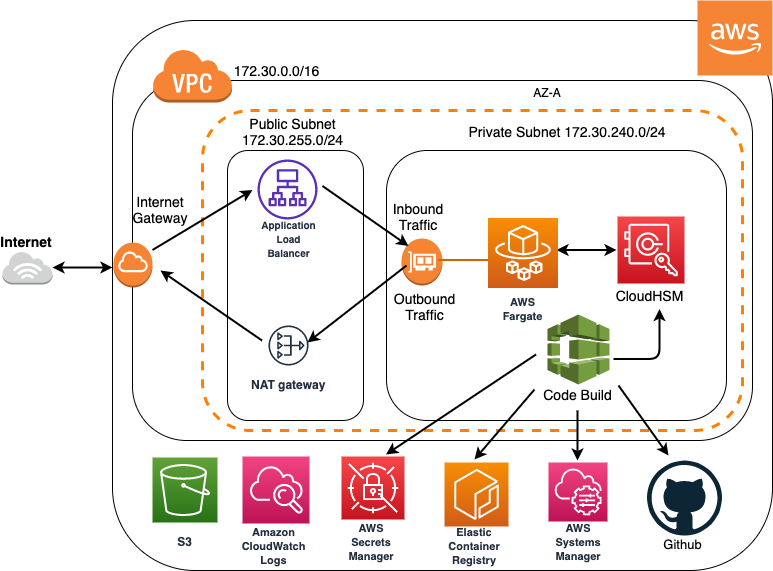
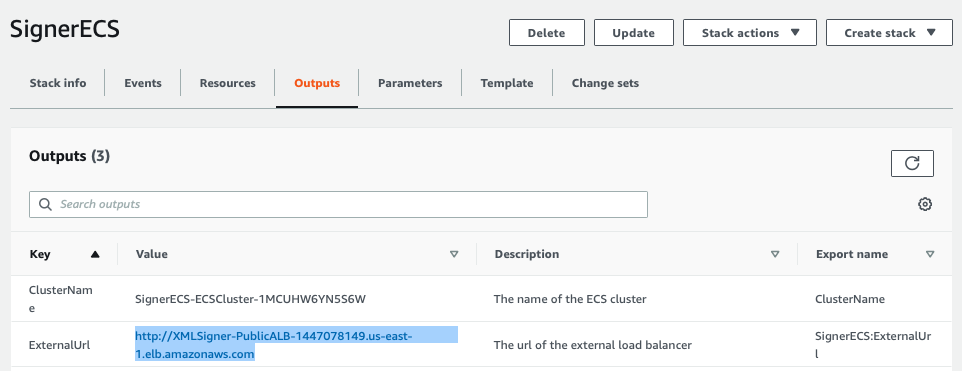
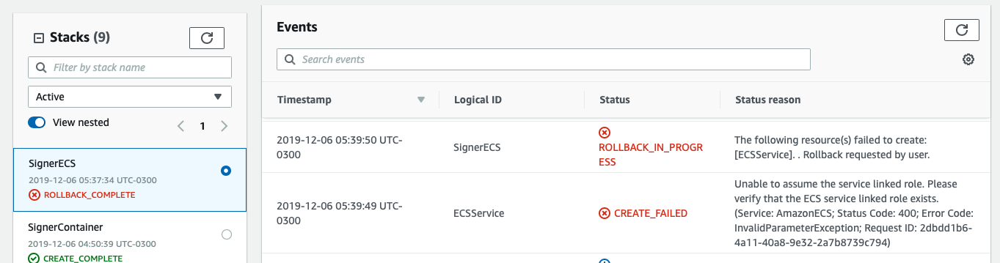

# Microserviço Signer - Assinatura de Nota Fiscal Eletrônica

Um microserviço para assinatura de notas fiscais eletônicas usando o formato XML. Este microserviço também é capaz de assinar qualquer documento XML. Em indústrias de pagamento, mais especificamente no Brasil, a lei determina que todas as notas ficais eletrônicas sejam digitalmente assinadas antes de enviadas aos consumidores. Um exemplo disto é o padrão NF-e ou Nota Fiscal Eletrônica.

O Signer cria um microserviço na AWS usando uma arquitetura de containers "serverless" (sem administração de servidores) e, via Iaac (infra como código), cria e implanta um microserviço que alavanca o uso do protocolo HTTP para assinar qualquer documento no formato XML.

O processo de assinatura do XML usa um HSM ou módulo de segurança de "hardware" ([AWS CloudHSM](https://aws.amazon.com/pt/cloudhsm/)) provisionado e configurado na nuvem. O microserviço é escrito em Java usando o Amazon Corretto e o processo criptográfico é melhorado com o uso do [Amazon Corretto Crypto Provider (ACCP)](https://aws.amazon.com/blogs/opensource/introducing-amazon-corretto-crypto-provider-accp/).  

Se preocupa com a performance? Se considerarmos 99% (p99) das requisições, o container do Fargate implantado por este projeto pode assinar um documento de 6KB em torno de 20ms (testado com uma NF-e real do Brasil).


## Arquitetura Proposta

Este projeto inclui scripts do CloudFormation para criar, configurar e implantar as seguintes estruturas:
  * Rede
  * CloudHSM  
  * Container Java para o processo de assinatura de documentos XML
  * [Serviço do ECS Fargate](https://aws.amazon.com/pt/fargate/)


A arquitetura propostas é:



## Links Rápidos

1. [Instalação](#Instalação)
2. [Usando o Signer Container](#Acessando-o-Container)
3. [Resolução de Problemas](#Resolução-de-Problemas)
4. [Limpeza](#Limpeza)

## Instalação

São necessários três passos para ter o seu microserviço implantado e executando:
Nota: O tempo total para este setup é de aproximadamente 40 minutos. O custo da infraestrutura implantada é de aproximadamente U$3.50 por hora (us-east-1 / Virgínia do Norte). **Para outras regiões, verifique se elas possuem o CodeBuild, Step Functions e CloudHSM**

### Implantação da Rede e do CloudHSM
  
|Implantação | Região |
|:---:|:---:|
|[][us-east-1-hsm-signer] | US East (N. Virginia)|
|[][us-east-2-hsm-signer] | US East (Ohio)|
|[][us-west-2-hsm-signer] | US West (Oregon)|
|[][sa-east-1-hsm-signer] | SA East (São Paulo)|

 
[Resolução de Problemas](#Resolvendo-Instalação-do-HSM)

**Detalhes:** Apenas assista: Você somente deve alterar os parâmetros do script caso as redes conflitem com as suas redes existentes. Após o script terminar de executar, a Step Function começará a criar e configurar automaticamente o seu CloudHSM. Após a Step Function terminar você pode executar o passo #2: Criar o Container

Este script cria um Step Function com um nome que começa por **LaunchCloudHSMCluster**. No console da AWS, vá em Step Functions e encontre a função com este nome. Espere pelo término da execução e parta para o próximo passo.
 
### Criar o Container
  
|Implantação | Região |
|:---:|:---:|
|[][us-east-1-container-signer] | US East (N. Virginia)|
|[][us-east-2-container-signer] | US East (Ohio)|
|[][us-west-2-container-signer] | US West (Oregon)|
|[][sa-east-1-container-signer] | SA East (São Paulo)|


[Resolução de Problemas](#Resolvendo-a-Criação-do-Container)

**Detalhes:** Existem 3 parâmetros que você precisa definir: CloudHSM Cluster Id, usuário do CloudHSM e senha do CloudHSM. Você pode escolher qualquer valor para o usuário e senha. (O usuário raiz do HSM Crypto Officer terá a mesma senha do usuário que você escolher como parâmetro para operar o CloudHSM. Para encontrar o CloudHSM Id é simples: Na console da AWS procure pelo serviço CloudHSM e você encontrará uma lista de clusters. Na lista de clusters você verá um cluster com o Cluster Id no seguinte formato: `cluster-xxxxxxxxx`. Este é o Cluster Id que você deverá usar como parâmetro para a execução do script. Deixe o seu Cluster Id anotado, pois ele será usado também no passo 3 (implantação do container).

 

Após a execução do script do CloudFormation você deverá usar a console da AWS para entrar no serviço AWS CodeBuild. Uma vez dentro do serviço CodeBuild, encontre um projeto chamado **xmlsigner** e inicie a atividade de build (imagem abaixo). Ele tomará em torno de 10 minutos para terminar de executar. Agora você já tem um CloudHSM implantado, configurado e um container com um serviço também criado e instalado dentro do registro de imagens do ECR.  Você está pronto para executar o container dentro do ECS Fargate. Mova para o próximo passo.

 


### Implantar o Container no Fargate

|Implantação | Região |
|:---:|:---:|
|[][us-east-1-ecs-signer] | US East (N. Virginia)|
|[][us-east-2-ecs-signer] | US East (Ohio)|
|[][us-west-2-ecs-signer] | US West (Oregon)|
|[][sa-east-1-ecs-signer] | SA East (São Paulo)|

Apenas siga os passos e espere pelo script terminar de executar. Pronto, pode usar o serviço!

[Resolução de Problemas](#Resolvendo-Implantação-no-ECS)

## Acessando o Container

O container executa as seguintes operaçãoes:

 * Listagem de chaves
 * Criação de chaves com um novo certificado (auto-assinado)
 * Assinatura
 * Validação
 
 **IMPORTANTE:** A abordagem recomendada para apagar chaves do CloudHSM é usar o software do [CloudHSM client](https://docs.aws.amazon.com/cloudhsm/latest/userguide/install-and-configure-client-linux.html) instalado dentro de uma máquina virtual Linux ou Windows na mesma rede do CloudHSM. Para configurar o cliente, o certificado necessário pode ser obtido dentro do ParameterStore e o password do HSM de dentro do Secrets Manager. Este método não está implementado dentro do microserviço, pois até este momento, a keystore to CloudHSM não implementa o "delete" de chaves. De acordo com [esta](https://docs.aws.amazon.com/cloudhsm/latest/userguide/alternative-keystore.html) documentação, apagar chaves não está suportado pela keystore do CloudHSM. Neste caso, o método recomendado é usar a ferramenta do **key_mgmt_util**.
 
 Após o script terminar de exeutar, dentro do serviço CloudFormation, você deverá acessar os detalhes da *Stack* e encontrar a aba *Output*. Nela você verá todas as URLs de acesso ao seu microserviço. Você poderá criar,  e listar chaves, assinar e validar um documento. 
 
 

O processo e assinatura é executado usando-se um certificado auto-assinado. Tudo acontece automaticamente. Quanto você cria uma chave, um certificado auto-assinado também é criado para a sua conveniência.

Dentro da pasta **run** deste projeto, tem um arquivo chamado **certdata.json** e você pode usá-lo para definir as propriedades que o seu certificado auto-assinado usará no momento da criação das chaves. Operar o container é bem simples e abaixo você encontrará os comandos que deverão ser usados, já validados para a sua conveniência. É possível usarmos também um Postman, porém baixando-se o projeto e executando os comandos abaixo a partir da raiz do projeto é o suficiente para que seja possível validar todas as funcionalidades do container:
 
### Store the service URL in an environment variable:
(remove the / at the end of the url)
```
URL=<alb-url>
```

### List existing keys:
 
```
curl $URL/xml/listKeys
```

### Create keys:

```
curl --data "@run/certdata.json" $URL/xml/create/<my-key-label> -X POST -H "Content-Type: text/plain"
```

### Sign XML Document (using certificate w/ public key)

```
curl --data "@run/sample.xml" $URL/xml/sign/<my-key-label> -X POST -H "Content-Type: application/xml" >> run/signed.xml
```

### Validate Signed Document

```
curl --data "@run/signed.xml" $URL/xml/validate -X POST -H "Content-Type: application/xml"
```


[us-east-1-hsm-signer]: https://console.aws.amazon.com/cloudformation/home?region=us-east-1#/stacks/new?stackName=SignerHSM&templateURL=https://s3.amazonaws.com/signer-hsm/SignerHSM.yaml
[us-east-2-hsm-signer]: https://console.aws.amazon.com/cloudformation/home?region=us-east-2#/stacks/new?stackName=SignerHSM&templateURL=https://s3.amazonaws.com/signer-hsm/SignerHSM.yaml
[us-west-2-hsm-signer]: https://console.aws.amazon.com/cloudformation/home?region=us-west-2#/stacks/new?stackName=SignerHSM&templateURL=https://s3.amazonaws.com/signer-hsm/SignerHSM.yaml
[sa-east-1-hsm-signer]: https://console.aws.amazon.com/cloudformation/home?region=sa-east-1#/stacks/new?stackName=SignerHSM&templateURL=https://s3.amazonaws.com/signer-hsm/SignerHSM.yaml
[us-east-1-container-signer]: https://console.aws.amazon.com/cloudformation/home?region=us-east-1#/stacks/new?stackName=SignerContainer&templateURL=https://s3.amazonaws.com/signer-hsm/SignerContainer.yaml
[us-east-2-container-signer]: https://console.aws.amazon.com/cloudformation/home?region=us-east-2#/stacks/new?stackName=SignerContainer&templateURL=https://s3.amazonaws.com/signer-hsm/SignerContainer.yaml
[us-west-2-container-signer]: https://console.aws.amazon.com/cloudformation/home?region=us-west-2#/stacks/new?stackName=SignerContainer&templateURL=https://s3.amazonaws.com/signer-hsm/SignerContainer.yaml
[sa-east-1-container-signer]: https://console.aws.amazon.com/cloudformation/home?region=sa-east-1#/stacks/new?stackName=SignerContainer&templateURL=https://s3.amazonaws.com/signer-hsm/SignerContainer.yaml
[us-east-1-ecs-signer]: https://console.aws.amazon.com/cloudformation/home?region=us-east-1#/stacks/new?stackName=SignerECS&templateURL=https://s3.amazonaws.com/signer-hsm/SignerECS.yaml
[us-east-2-ecs-signer]: https://console.aws.amazon.com/cloudformation/home?region=us-east-2#/stacks/new?stackName=SignerECS&templateURL=https://s3.amazonaws.com/signer-hsm/SignerECS.yaml
[us-west-2-ecs-signer]: https://console.aws.amazon.com/cloudformation/home?region=us-west-2#/stacks/new?stackName=SignerECS&templateURL=https://s3.amazonaws.com/signer-hsm/SignerECS.yaml
[sa-east-1-ecs-signer]: https://console.aws.amazon.com/cloudformation/home?region=sa-east-1#/stacks/new?stackName=SignerECS&templateURL=https://s3.amazonaws.com/signer-hsm/SignerECS.yaml

## Resolução de Problemas

### Resolvendo Instalação do HSM

 Umas das configurações disponíveis neste step é a escolha da AZ para o seu CloudHSM. Em alguns casos, é possível que o endpoint do serviço do CloudHSM não esteja disponível na AZ escolhida para a sua subnet privada. Por favor, apague e recrie a Stack usando um AZ diferente para a sua subnet privada. Para fazer isto, apague a stack antiga e tente novamente usando [este](#Implantação-da-Rede-e-do-CloudHSM) botão de criar Stack. Uma vez no menu de configuração, escolha outra AZ para a sua subnet privada usando o botão de seleção. Algumas regiões onde isto pode acontecer: sa-east-1, us-east-1, us-east-2.
 
### Resolvendo a Criação do Container
 
 Neste passo, o CodeBuild tenta conectar-se ao GitHub para baixar os fontes do container. Caso você nunca tenha configurado credenciais do Git no CodeBuild, você vai ver o erro da imagem abaixo sendo lançado pelo CloudFormation. Isto significa que o CodeBuild não sabe conectar no GitHub e que você terá que configurar credenciais para isto. Neste caso, relaxe, é simples!
 
  
 
 **Configurar credenciais do GitHub no CodeBuild:** Vá para o serviço do CodeBuild na sua região usando a console da AWS. Uma vez dentro do menu do CodeBuild, finja que você está criando um novo **build**. Escolha Criar Projeto de Build. Na tela de configuração tem uma seção chamada Fontes (ou Source). Escolha `GitHub`, e `Conectar using OAuth` (se tiver dúvida faça como na imagem abaixo). Uma vez conectado, pressione CANCEL e execute o script de criação da Stack do CloudFormation novamente. (valide se você visualizou a mensagem **você está conectado ao Github usando OAuth**). Agora o CodeBuild sabe como baixar os fontes do Github.
 
 **Apague a Stack Signer Container no serviço do CloudFormation e clique novamente [neste](#Criar-o-Container) botão para rodar a Stack novamente**
 
 
 
### Resolvendo Implantação no ECS

 Caso você nunca tenha usado o serviço do ECS você pode não ter uma service linked role para o serviço do ECS. Verifique se o erro da sua Stack do CloudFormation é o erro da imagem abaixo e, caso positivo, olhe [esta](https://docs.aws.amazon.com/AmazonECS/latest/developerguide/using-service-linked-roles.html) documentação para maiores detalhes.
 
  
 
 Execute o comando abaixo usando a CLI da AWS para corrigir o problema da falta do `service linked role`. Após executado o comando, apague a Stack Signer ECS e clique novamente neste botão para refazer a implantação da Stack SignerECS. 
 ```
 $ aws iam create-service-linked-role --aws-service-name ecs.amazonaws.com
 ```
 
 ## Limpeza
 
  O procedimento de limpeza possui quatro passos manuais. Isto acontece, pois parte da infraestrutura teve que ser criada por uma Step Function (Stack SignerHSM). Para limpar o ambiente execute os passos na ordem abaixo:
  
  1. Apagar a terceira Stack: `SignerECS`
  2. Apagar manualmente as imagens do seguinte repositório do ECR: `xmlsigner`
  3. Apagar a segunda Stack: `SignerContainer`
  4. Apagar manualmente a instância do CloudHSM dentro do seu cluster de CloudHSM. Espere pelo término (menu CloudHSM no console)
  5. Apagar manualmente o cluster do CloudHSM
  6. Apagar manualmente todas as regras **inbound** e **outbound** do Security Group que tenha um  **group name** cujo nome tem o seguinte padrão: `cloudhsm-<ClusterId>`, aonde o ClusterId seja o the cluster id do seu CloudHSM cluster recém agapado, no seguinte formato: `cluster-xxxxxxxxx`
  7. Apague a terceira Stack:  `SignerHSM`
